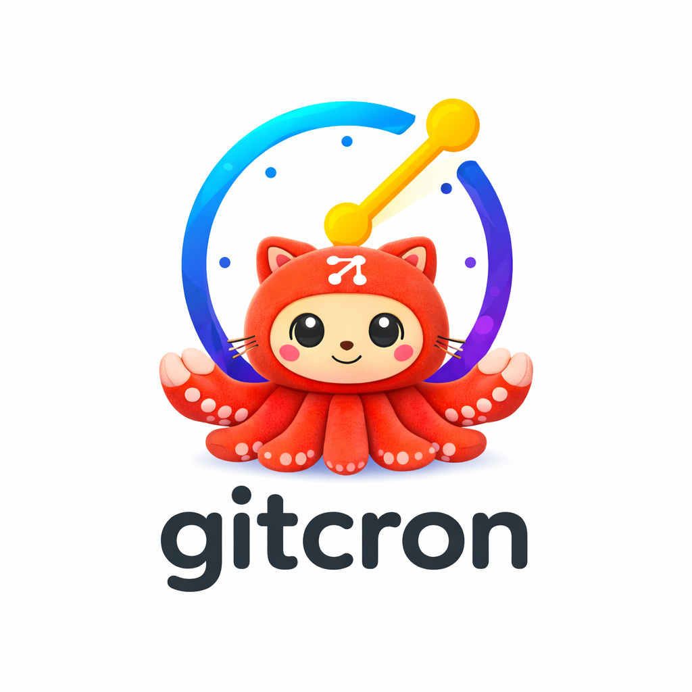

<p align="center">
  
</p>

<p align="center">
  
  
  
  
</p>

<h1 align="center">Gitcron</h1>

<p align="center">
  <strong>Cron for AI agents.</strong><br/>
  Schedule any AI agent — gitclaw, gitagent, Claude Code SDK, OpenAI, or your own — using <code>cron.yaml</code> compiled to GitHub Actions.<br/>
  No custom runtime. No infra. Just git.
</p>

<p align="center">
  <a href="#quick-start">Quick Start</a> &bull;
  <a href="#cronyaml">cron.yaml</a> &bull;
  <a href="#cli-commands">CLI Commands</a> &bull;
  <a href="#compatible-agents">Compatible Agents</a> &bull;
  <a href="#branch-strategies">Branch Strategies</a> &bull;
  <a href="#adapters">Adapters</a>
</p>

---

## Why Gitcron?

**AI agents need cron.** Agents review PRs, fix lint, run audits, validate models, and track compliance — but there's no standard way to schedule them. Gitcron is **cron for AI agents**:

1. Define schedules, tasks, and reminders in `cron.yaml`
2. Run `gitcron generate` to compile into GitHub Actions workflows
3. Commit and push — GitHub runs your agents automatically

Works with **any agent framework** via gitagent adapters:

| Agent / Framework | Adapter | How it works |
|---|---|---|
| **gitclaw** | `gitclaw` | Full runtime with tools, hooks, audit, compliance |
| **gitagent** | `claude` / `openai` | Framework-agnostic agent standard |
| **Claude Code SDK** | `claude` | Claude-powered code agents |
| **OpenAI** | `openai` | GPT-powered agents |
| **Any LLM** | `system-prompt` | Generic system prompt export |
| **Shell commands** | `command` | Any CLI tool, script, or binary |

## Install

```bash
npm install -g gitcron
```

## Quick Start

```bash
# Scaffold a new gitcron configuration
gitcron init --template standard

# Validate your configuration
gitcron validate

# Generate GitHub Actions workflow files
gitcron generate

# Preview without writing
gitcron generate --dry-run
```

## cron.yaml

```yaml
spec_version: "0.1.0"
name: my-project-cron

schedules:
  - name: nightly-code-review
    cron: "0 2 * * *"
    agent: code-reviewer
    adapter: claude
    prompt: "Review all open PRs"
    branch:
      strategy: pr
      base: main

  - name: weekly-lint
    cron: "0 6 * * 1"
    command: "npm run lint -- --fix"
    branch:
      strategy: commit
      base: main

tasks:
  directory: ".gitcron/tasks"
  states: [pending, in_progress, review, done, cancelled]
  transitions:
    pending: [in_progress, cancelled]
    in_progress: [review, done, cancelled]
    review: [in_progress, done]
    done: []
    cancelled: []

reminders:
  - name: quarterly-review
    type: recurring
    cron: "0 9 1 */3 *"
    action:
      type: issue
      title: "Quarterly Review Due"
```

## CLI Commands

### `gitcron init`

Scaffold a new configuration.

```bash
gitcron init                        # Standard template
gitcron init --template minimal     # Minimal template
gitcron init --template full        # Full template with all options
```

### `gitcron generate`

Compile `cron.yaml` into GitHub Actions workflow files.

```bash
gitcron generate              # Write workflow files
gitcron generate --dry-run    # Preview output
gitcron generate --diff       # Show changes
gitcron generate --force      # Overwrite manually-edited files
```

### `gitcron validate`

Validate `cron.yaml` against the schema.

```bash
gitcron validate              # Validate
gitcron validate --strict     # Treat warnings as errors
```

### `gitcron list`

List schedules, tasks, and reminders.

```bash
gitcron list                  # Show everything
gitcron list --schedules      # Schedules only
gitcron list --tasks          # Tasks only
gitcron list --reminders      # Reminders only
```

### `gitcron status`

Show an overview of your gitcron configuration.

### `gitcron task`

Git-native task management. Every mutation creates a git commit.

```bash
gitcron task create "Update docs" --priority high --assignee alice
gitcron task list
gitcron task list --state pending
gitcron task update TASK-001 --state in_progress
gitcron task show TASK-001
```

### `gitcron remind`

Manage reminders.

```bash
gitcron remind create weekly-sync --cron "0 9 * * 1" --title "Weekly Sync"
gitcron remind list
gitcron remind fire weekly-sync     # Manually trigger
gitcron remind pause weekly-sync
gitcron remind resume weekly-sync
```

## Compatible Agents

Gitcron is the scheduling layer for the entire AI agent ecosystem. Any agent that can run as a CLI command can be scheduled:

- **gitclaw** — Enterprise agent runtime with built-in tools, hooks, audit logging, and compliance. Best for regulated environments.
- **gitagent** — Open git-native agent standard. Adapters for Claude, OpenAI, and any LLM.
- **Claude Code SDK** — Build and schedule Claude-powered agents via the `claude` adapter.
- **OpenAI agents** — Schedule GPT-powered agents via the `openai` adapter.
- **Custom agents** — Use `command` to schedule any script, binary, or CLI tool.

Gitcron ships with **skills** that teach agents how to manage their own schedules, tasks, and reminders — enabling self-scheduling agents that can create follow-up jobs, track work items, and set compliance deadlines autonomously.

## Branch Strategies

| Strategy | Behavior |
|----------|----------|
| `pr` | Create branch, run, commit, push, open PR |
| `create` | Create branch, run, commit, push (no PR) |
| `commit` | Run, commit, push directly to base branch |
| `none` | Run only (no git operations) |

## Schedule Types

### Agent schedules

Run a gitagent agent on a schedule:

```yaml
schedules:
  - name: code-review
    cron: "0 2 * * *"
    agent: code-reviewer
    adapter: claude
    prompt: "Review open PRs"
```

### gitclaw agent schedules

Run an agent using the gitclaw runtime (full tools, hooks, audit, compliance):

```yaml
schedules:
  - name: code-review
    cron: "0 2 * * *"
    agent: code-reviewer
    adapter: gitclaw
    prompt: "Review open PRs"
    agent_source:
      type: local
      path: "./agents/code-reviewer"
    secrets: [ANTHROPIC_API_KEY]
```

The generated workflow installs and runs `gitclaw -d <dir> -p <prompt>` instead of `gitagent run`.

### Command schedules

Run any shell command on a schedule:

```yaml
schedules:
  - name: lint-fix
    cron: "0 6 * * 1"
    command: "npm run lint -- --fix"
```

## Adapters

| Adapter | Runtime | Install | Best for |
|---------|---------|---------|----------|
| `claude` | Claude Code via gitagent | `gitagent` | Code changes, PRs |
| `openai` | OpenAI API via gitagent | `gitagent` | Analysis, reviews |
| `gitclaw` | gitclaw runtime (pi-agent-core) | `gitclaw` | Full agent with tools, hooks, audit, compliance |
| `system-prompt` | System prompt export via gitagent | `gitagent` | Generic LLM integration |

## Part of the open-gitagent ecosystem

- [gitagent](https://github.com/open-gitagent/gitagent) — Git-native AI agent standard
- [gitclaw](https://github.com/open-gitagent/gitclaw) — Universal git-native agent runtime
- **gitcron** — Git-native scheduling and task management

## Contributing

Contributions are welcome! Please open an issue or submit a pull request.

## License

MIT
